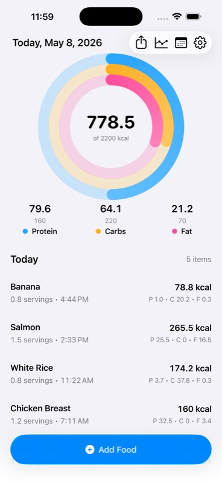
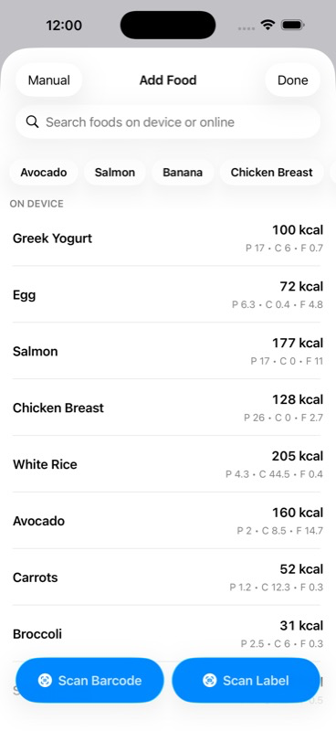
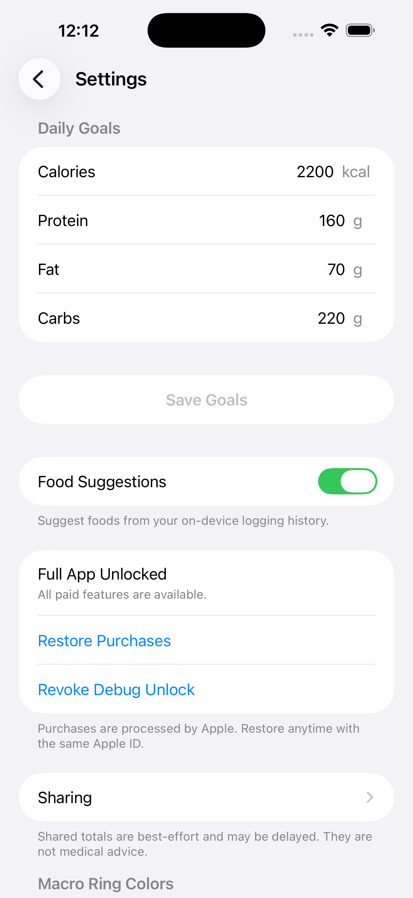
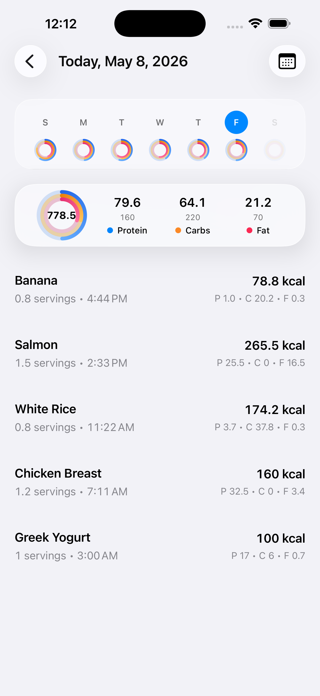
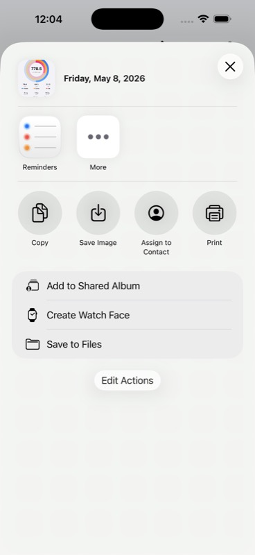

# MACROS

MACROS is a local-first calorie and macro tracker for iPhone, with a small supporting web and backend surface.

- `cal-macro-tracker/` — the native iPhone app with widgets
- `convex-backend/` — the optional sharing backend
- `worker/auth/` — the auth worker used by sharing
- `worker/usda-proxy/` — the food-search API worker
- `web/` — the product, privacy, waitlist, and support site
  - <https://macros-web.jhonra121.workers.dev/>

The app stays local-first: no required account for normal tracking, on-device food/log data by default, and optional network features layered on top for invite sharing and packaged-food search.

## Screenshots

### Home

<p align="center">
  
</p>

### Logging

<p align="center">
  
</p>

### Settings

<p align="center">
  
</p>

### History

<p align="center">
  
  &nbsp;&nbsp;
  
</p>

### Sharing

<p align="center">
  
</p>

## Features

- **Dashboard** — daily calorie and macro progress, logged foods, quick edits, and shareable summaries
- **Food logging** — log common foods, saved foods, searched foods, custom foods, suggestions, or manual entries, with servings/grams math handled deterministically
- **Scanning** — barcode scanning and nutrition-label scanning, including camera/photo fallback paths and editable review before logging
- **Search and suggestions** — offline common foods, saved-food suggestions, packaged-food search, and saved reusable foods
- **History** — calendar-based browsing of past days and weekly progress
- **Insights** — premium nutrition graphs and trends for calories, macros, consistency, and goal progress
- **Sharing dashboard** — optional no-account sharing with Convex-backed invite links, shared macro rings, today's totals, per-person controls, and revocation/delete flows
- **Widgets** — Home Screen and Lock Screen widgets for daily macro progress
- **Settings** — daily goals, saved foods, macro ring colors, sharing, preferences, and Full Unlock purchase/restore
- **Premium unlock** — StoreKit-backed Full Unlock for premium graphs and customization
- **Offline-first** — local persistence, cached lookups, and graceful network absence

## Workspace Overview

| Path | Stack | Purpose |
|---|---|---|
| `cal-macro-tracker/` | SwiftUI, SwiftData, WidgetKit, StoreKit, Convex | Native iPhone calorie and macro tracking app |
| `convex-backend/` | Convex, TypeScript, Bun | Optional sharing backend for invite-based macro dashboard sharing |
| `worker/auth/` | Cloudflare Workers, Hono, TypeScript, Bun | Auth and invite-link worker for sharing |
| `worker/usda-proxy/` | Cloudflare Workers, Hono, TypeScript, Bun | Food-search API worker |
| `web/` | Astro, Cloudflare, TypeScript, Bun, D1 | Product site, waitlist, and support form |

## Requirements

### Apple app

- **Xcode 26+** (Swift 6, SwiftUI, SwiftData, WidgetKit)
- macOS with Xcode command-line tools installed
- iPhone Simulator or device target

### Worker and web

- [Bun](https://bun.sh) for package management and scripts
- [Wrangler CLI](https://developers.cloudflare.com/workers/wrangler/) for local dev and deployment
- A [USDA FoodData Central API key](https://fdc.nal.usda.gov/api-key-signup) for `worker/usda-proxy`
- Node.js `>=22.12.0` for the Astro site runtime/tooling expectations
- Convex project configuration for optional sharing features

## Project Structure

```
cal-macro-tracker/
├── cal-macro-tracker/          # Apple app source
│   ├── App/                    # App shell, routing, widget/shared entry points
│   ├── CalMacroWidget/         # WidgetKit extension, including Lock Screen widget
│   ├── CommonFoods/            # Bundled common_foods.json seed data
│   ├── Data/                   # SwiftData models and services
│   ├── Features/               # App features such as Dashboard, Add Food, Scan, Insights, Sharing, Settings
│   └── Shared/                 # Shared UI, formatting, and app helpers
├── worker/
│   ├── auth/                   # Cloudflare auth worker for sharing profiles and invite redirects
│   └── usda-proxy/             # Cloudflare Worker API for USDA + OFF search
├── convex-backend/             # Convex backend for optional macro sharing
├── web/
│   ├── src/                    # Astro pages, layouts, components, support/waitlist APIs
│   ├── migrations/             # D1 schema migrations for support and waitlist data
│   └── public/                 # Static site assets
├── tools/
│   └── quality/                # Shell-based repo quality checks
├── Makefile                    # Apple-side quality commands
└── cal-macro-tracker.xcodeproj # Xcode project for app and widget targets
```

## Local Development

### iPhone app

```sh
xcodebuild -project "cal-macro-tracker.xcodeproj" \
  -scheme "cal-macro-tracker" \
  -configuration Debug \
  -destination 'generic/platform=iOS Simulator' \
  build
```

The Apple project includes the main `cal-macro-tracker` app scheme and the `CalMacroWidget` widget extension scheme. Local StoreKit testing uses `FullUnlock.storekit`.

### Convex sharing backend

The app uses `convex-backend/` for optional invite-based macro sharing. Normal food logging does not require it.

```sh
cd convex-backend
bun install
bun run dev
bun run check
```

### Sharing auth worker

The sharing flow also uses `worker/auth/` for app sharing identity, Convex auth tokens, and invite-link redirects.

```sh
cd worker/auth
bun install
bun run dev                      # starts on http://127.0.0.1:8788
bun run check
```

### Worker API

The app searches packaged foods through `worker/usda-proxy/`, a Cloudflare Worker that keeps provider lookups outside the app and combines Open Food Facts with USDA fallback.

```sh
cd worker/usda-proxy
cp .dev.vars.example .dev.vars   # add your USDA_API_KEY
bun install
bun run dev                      # starts on http://127.0.0.1:8787
bun run check
```

In debug simulator builds the app automatically points to `http://127.0.0.1:8787`.

```sh
cd worker/usda-proxy
bun run deploy
```

The `USDA_API_KEY` secret must be set in your Cloudflare Workers dashboard.

### Astro web app

The Astro site in `web/` powers the product landing page, waitlist, privacy/about pages, and support flow. Support requests and waitlist entries post into D1-backed API routes.

```sh
cd web
bun install
bun run dev
bun run check
bun run build
```

For deployment and schema changes:

```sh
cd web
bun run db:migrations:apply:local
bun run deploy
```

## Quality Checks

Apple app quality commands:

```sh
make quality
```

App-specific targets:

| Target | What it does |
|---|---|
| `make quality-build` | Verifies the Xcode target builds |
| `make quality-format-check` | Runs the official `swift-format` formatter in lint mode |
| `make format` | Applies the official `swift-format` formatter to app source |
| `make quality-dead` | Runs Periphery dead-code detection |
| `make quality-dup` | Scans for duplicated code blocks |
| `make quality-debt` | Flags TODO/FIXME/HACK, `fatalError`, oversized files/functions |
| `make quality-deps` | Reports dependency surface from the Xcode project |
| `make quality-n1` | Heuristic SwiftData N+1 query detection |
| `make quality-secrets` | Validates no real secrets leak into example env files |

Type checks outside the Xcode project:

| Package | Command |
|---|---|
| `convex-backend` | `bun run check` |
| `worker/auth` | `bun run check` |
| `worker/usda-proxy` | `bun run check` |
| `web` | `bun run check` |

### Optional tooling

- [swift-format](https://github.com/swiftlang/swift-format) — official Swift formatter — `brew install swift-format`
- [Periphery](https://github.com/peripheryapp/periphery) — `brew install periphery`

## Architecture

- **Native iPhone app** — SwiftUI app with local persistence, widgets, StoreKit purchase flow, scanning, insights, and sharing
- **Local-first core** — nutrition logs remain on-device; accounts are not required for normal tracking
- **Optional services** — Convex powers invite-based sharing, while Cloudflare powers sharing auth, packaged-food search, and the web/support/waitlist surface
- **Review-first logging** — scans and remote results route through editable screens before anything is saved
- **Small backend surface** — network features are additive and isolated from the core logging experience

## License

This project does not currently include a license file. All rights reserved unless otherwise stated.
